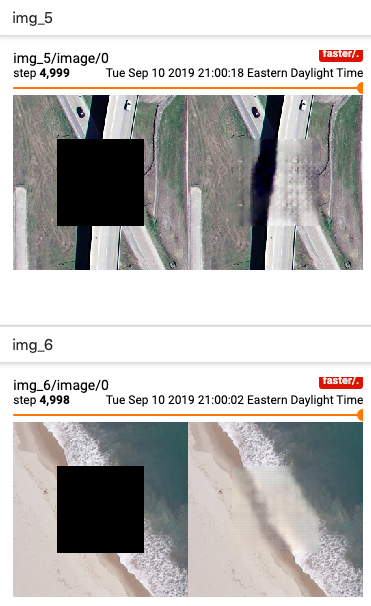

# Feature Extractor trainers

The `patchwork.feature` module has several models implemented for unsupervised or self-supervised representation learning:

* [Context Encoders](https://arxiv.org/abs/1604.07379)
* [DeepCluster](https://arxiv.org/abs/1807.05520)
* [Invariant Information Clustering](https://arxiv.org/abs/1807.06653)

The module has a class to manage the training of each model. You can initialize the trainer with a fully-convolutional `keras` model for it to train (otherwise it will use a default model).

In addition to each model's training hyperparameters, the different feature extractor trainers share [input pipeline and augmentation parameters](input_aug.md).

For each of the above methods, `patchwork` has a training class that:

* inputs a list of paths to training files and a `keras` fully-convolutional model to train
* can input a list of paths to test files to compute out-of-sample metrics and visualizations for TensorBoard
* can input a dictionary mapping image file paths to labels- you can use this to monitor the feature extractor's performance on a downstream task. At the end of every epoch, the trainer:
  * deterministically splits the labeled data into training and test sets (2:1)
  * computes features for each of the labeled images using the fully-convolutional network and a global average pool
  * fits a linear softmax model to predict categories and evaluates accuracy on the test set
  * records test accuracy, confusion matrix, and hyperparameters in TensorBoard.


## Context Encoder

The `patchwork.feature` module contains an implementation of the algorithm in Deepak Pathak *et al*'s [Context Encoders: Feature Learning by Inpainting](https://arxiv.org/abs/1604.07379). The primary difference is that my implementation is missing the amplified loss function in the border region between masked and unmasked areas.

The trainer can input a list of test files- a small out-of-sample dataset is handy for visualizing how well the inpainter can reconstruct images (as opposed to just memorizing your data).

```{python}
import tensorflow as tf
import patchwork as pw

# load paths to train and test files
trainfiles = [x.strip() for x in open("mytrainfiles.txt").readlines()]
testfiles = [x.strip() for x in open("mytestfiles.txt").readlines()]

# initialize trainer and train
trainer = pw.feature.ContextEncoderTrainer(
    "logs/",
    trainfiles,
    testdata=testfiles,
    num_parallel_calls=6,
    augment=aug_params,
    lr=1e-3,
    batch_size=32,
    imshape=(255,255)
)
```

Tensorboard logs will be stored for the loss function on `testfiles` as well as visualization on inpainting:




### Some notes on using Context Encoders

* CE can overfit easily on small datasets (and increasing the noise added by augmentation can help considerably). Reserving a small out-of-sample dataset to measure reconstruction loss on can help you identify when this is happening.


## DeepCluster

`patchwork` contains a TensorFlow implementation of the algorithm in Mathilde Caron *et al*'s [Deep Clustering for Unsupervised Learning of Visual Features](https://arxiv.org/abs/1807.05520).

I tried to keep the parameters as similar to the paper as possible. One additional keyword argument is `mult` (integer, default 1). Caron *et al* refit the k-means algorithm once per epoch on Imagenet (with `batch_size=256` this works out to roughly 5000 steps between refitting the pseudolabels). If you're working on a significantly smaller dataset you may need to run through it multiple times before refitting; set `mult=N` to refit once every `N` epochs.

Also, learning rate decay wasn't used in Caron *et al* but I've occasionally found it helpful. The `lr_decay` kwarg sets the half-life of the learning rate.

```{python}
import tensorflow as tf
import patchwork as pw

# load paths to train files
trainfiles = [x.strip() for x in open("mytrainfiles.txt").readlines()]

# initialize a feature extractor
fcn = patchwork.feature.BNAlexNetFCN()

# train
dctrainer = pw.feature.DeepClusterTrainer(
        "logs/",
        fcn=fcn,
        trainingdata=trainfiles,
        augment=True, # or pass a dict of aug parameters here
        pca_dim=256
        k=250,
        dense=[1024, 1024],
        lr=1e-3,
        lr_decay=100000,
        batch_size=64,
        num_parallel_calls=6
    )

dctrainer.fit(10)
```

### Some notes on using DeepCluster

* I notice much faster training when I transfer learn from a network pretrained on ImageNet than with random weights (within 10 epochs rather than hundreds on UCMerced, for example)
* Transfer learning from a network pretrained with DeepCluster, using different parameters, can give weird results.
        
## Invariant Information Clustering

DOCS COMING SOON


### Some notes on using IIC

* COMING SOON
        
## Momentum Contrast

DOCS COMING SOON

[paper here](https://arxiv.org/abs/1911.05722)

### Some notes on using MoCo

* COMING SOON
